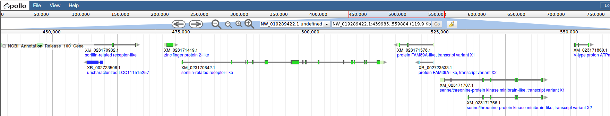

# Introduction
A JBrowse plugin to color the features according the feature type. This plugin is derived from the [Apollo](https://github.com/GMOD/Apollo) plugin **DraggableHTMLFeatures**.

# Screenshot

- Several feature types (e.g. mRNA, lncRNA, tRNA) were loaded into one track. The coloring of the exon/CDS boxes is related to the feature type of its parent.

# Requirement
- [color-hash](https://github.com/zenozeng/color-hash)

# Install
## ColorByType
Download to plugins/ColorByType and change the type to `ColorByType/View/Track/ColorByTypeDraggable`
```
     {
         "category" : "NCBI Annotation Release 100/1. Gene Sets/NCBI_Annotation_Release_100_Gene",
         "key" : "NCBI_Annotation_Release_100_Gene",
         "label" : "NCBI_Annotation_Release_100_Gene",
         "trackType" : null,
         "type" : "ColorByType/View/Track/ColorByTypeDraggable",
         "urlTemplate" : "tracks/NCBI_Annotation_Release_100_Gene/{refseq}/trackData.json"
      },
```

## The coloring of the common feature types
- mRNA
    - exon `#d7f7c0`
    - CDS `#28db25`
- lnc_RNA
    - exon `#262dff`
- snoRNA
    - exon `#7cedff`
- transcript
    - exon `#c589c6`
- rRNA
    - exon `#fff200`
- snRNA
    - exon `#80a823`
- tRNA
    - exon `#ef7902`
- Others feature types will be colored by color-hash
### Change/Add color for feature types
Others feature types will be colored by color-hash. If you want to change or add color for feature types, you can modifiy the style in [ColorByTypeDraggable.js](js/View/Track/ColorByTypeDraggable.js#L84-L124) or use [hooks→modify](http://gmod.org/wiki/JBrowse_Configuration_Guide#HTMLFeatures_Configuration_Options) options for customization.

#### color for exon
To change or add color for exon features, you can add more `else...if` statment to [here](js/View/Track/ColorByTypeDraggable.js#L89-L106).
Example:  
``` shell
// color of exon
if (type == 'mRNA') {
    div.children[i].children[j].style.backgroundColor = '#d7f7c0';
} else if (type == 'tRNA') {
    div.children[i].children[j].style.backgroundColor = '#ef7902';
} else if (type == '[new_featuretype]') {
    div.children[i].children[j].style.backgroundColor = '[Color Hex Color Codes]';
} else {
    div.children[i].children[j].style.backgroundColor = colorHash.hex(concat_subClassName);
}
```

#### color for CDS
To change or add color for CDS features, you can add more `else...if` statment to [here](js/View/Track/ColorByTypeDraggable.js#L109-L114).
Example:
```shell
// color of CDS
if (type == 'mRNA') {
    div.children[i].children[j].style.backgroundColor = '#28db25';
} else if (type == '[new_featuretype]') {
    div.children[i].children[j].style.backgroundColor = '[Color Hex Color Codes]';
} else {
    div.children[i].children[j].style.backgroundColor = colorHash.hex(concat_subClassName);
}
```


## Internal Dependencies

- [css/main.css](css/main.css)
    - The custom css for the track styles.
- [jslib/color-hash](jslib/color-hash)
    - Functions for generating color based on the given string. Download from [color-hash](https://github.com/zenozeng/color-hash).